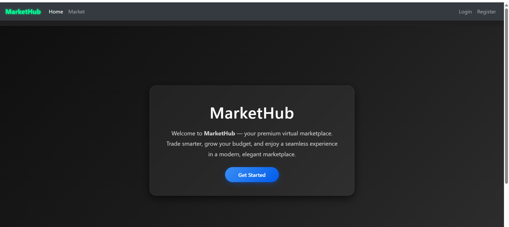
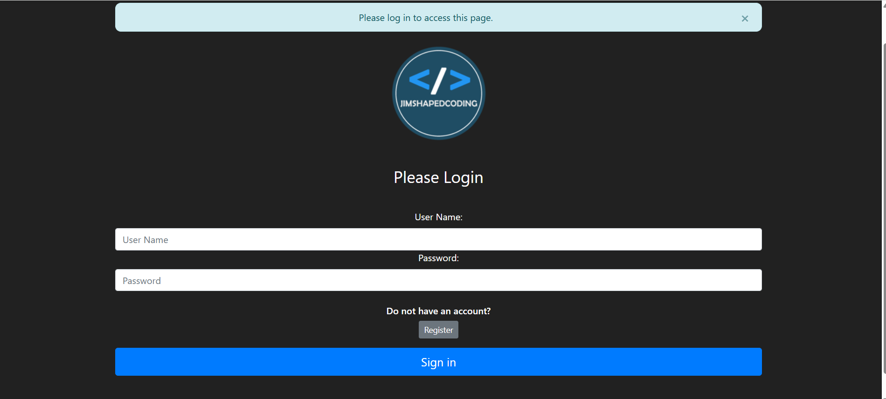
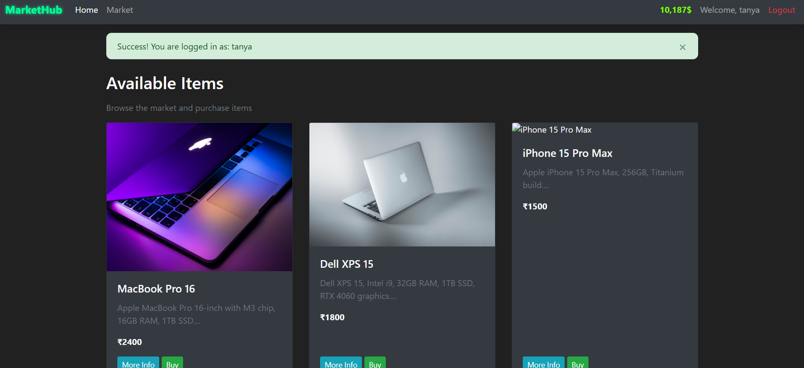
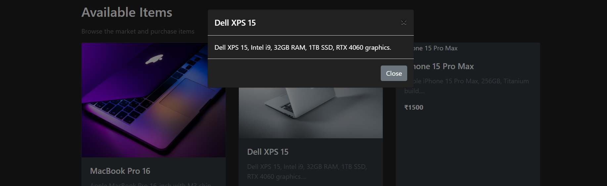
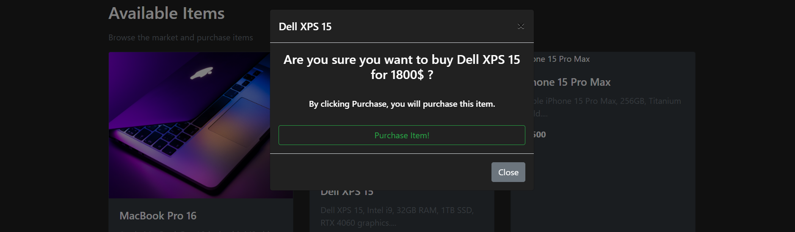
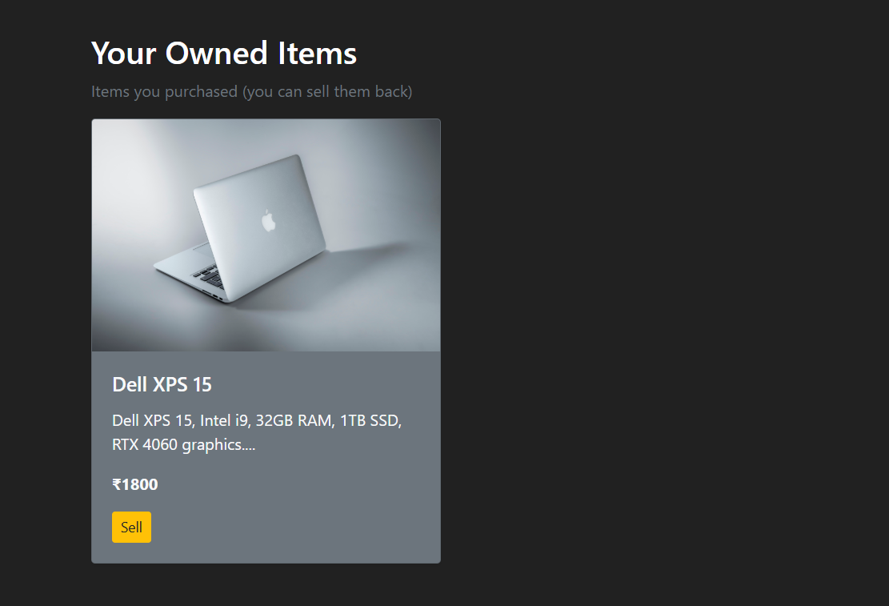
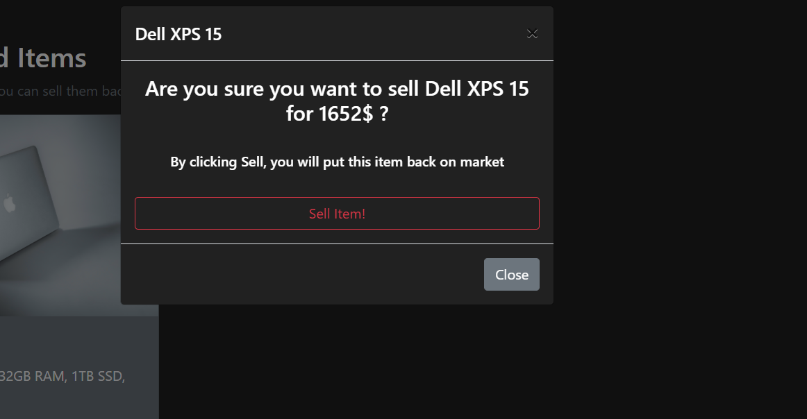

# MarketHub: An Online Marketplace Web Application

MarketHub is a full-stack simulated marketplace built with Python and Flask. This application provides a hands-on learning environment for e-commerce by granting each user a starting budget to practice buying and selling items. The core of the platform is to allow users to experience making a profit or loss based on their trading decisions in a secure, sandbox environment.It features a clean, responsive user interface and robust backend logic for handling all aspects of the simulation, including product management, user authentication, and transaction histories.
---

### Screenshots

---

---

---

---

---

---

---

## Features

-   **User Authentication:** Secure user registration and login system with password hashing.
-   **Product Marketplace:** Browse a gallery of available items for sale.
-   **Shopping Cart:** Add and remove items from a persistent shopping cart.
-   **Secure Transactions:** "Purchase" items, which transfers ownership and updates the user's budget.
-   **Sell Items:** Users can sell items they own back to the marketplace.
-   **Responsive Design:** A clean and intuitive user interface built with Bootstrap that works seamlessly across all devices.

---

## Tech Stack

-   **Backend:** Python, Flask
-   **Database:** Flask-SQLAlchemy, SQLite (or other relational databases)
--   **Frontend:** HTML, CSS, Bootstrap
-   **Forms & Security:** Flask-WTF, Flask-Bcrypt
-   **Authentication:** Flask-Login

---

